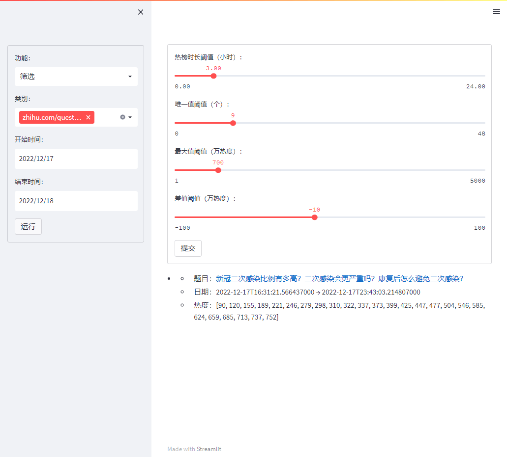

<!-- Template from https://github.com/othneildrew/Best-README-Template -->

<!-- PROJECT LOGO -->
 

  <a href="https://github.com/iydon/zhihu">
    🔵🟦🟦🟦 
    ⬜⬜🟦⬜ 
    ⬜🟦⬜⬜ 
    🟦🟦🟦🟦 
  </a>

  <h3 align="center">知乎热榜</h3>

  

    <a href="https://github.com/iydon/zhihu">查看源码</a>
    ·
    <a href="https://github.com/iydon/zhihu/issues">报告故障</a>
    ·
    <a href="https://github.com/iydon/zhihu/issues">请求功能</a>
  

<!-- STREAMLIT APP -->
# Streamlit App 功能

  
<strong>绘图</strong>

  

  
<strong>筛选</strong>

  

  
<strong>词云</strong>

  

